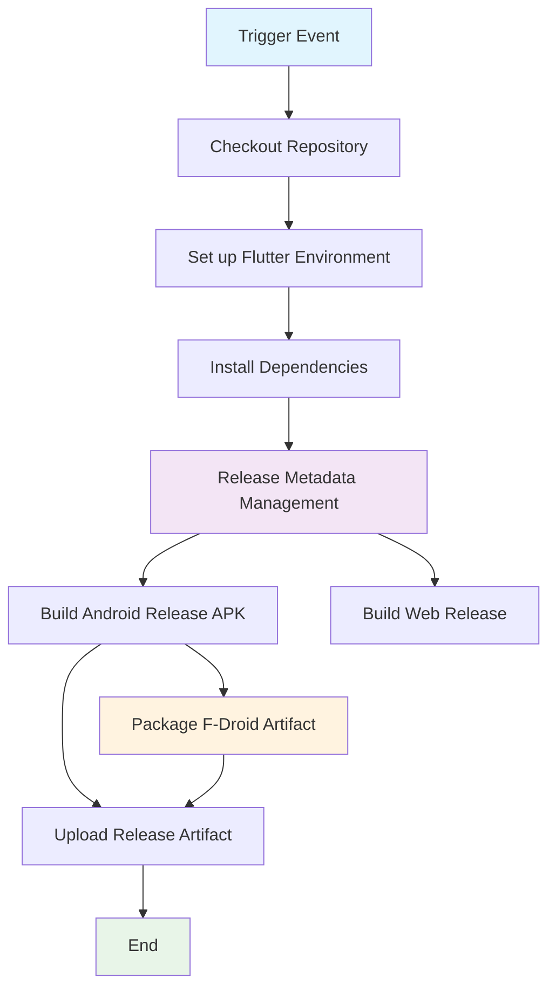

## Workflow Overview

**Purpose**: Build the Flutter release artifacts and distribute the Android package through GitHub release mechanisms and F-Droid distribution channels.
**Trigger Events**:
- Push to `main`
- Manual workflow dispatch
**Target Environments**:
- GitHub Actions hosted runners
- Android/F-Droid packaging and distribution
- GitHub release artifact storage

## Execution Flow Diagram



## Jobs & Dependencies

| Job Name | Purpose | Dependencies | Execution Context |
|----------|---------|--------------|-------------------|
| release | Create release metadata, build artifacts, and trigger distribution | trigger event | GitHub Actions runner (`ubuntu-latest`) |

## Requirements Matrix

### Functional Requirements
| ID | Requirement | Priority | Acceptance Criteria |
|----|-------------|----------|-------------------|
| REQ-001 | Run release pipeline for main branch changes | High | Workflow triggers on main and manual dispatch |
| REQ-002 | Build Android release artifact suitable for F-Droid | High | Android release APK is produced at a reproducible path |
| REQ-003 | Create or update release metadata for each release cycle | High | Release tag and release notes are generated and persisted |
| REQ-004 | Upload release APK to GitHub release assets | Medium | APK is attached to the release when a release is created |
| REQ-005 | Prepare distribution package for F-Droid ingestion | High | Artifact and metadata are available for F-Droid distribution steps |

### Security Requirements
| ID | Requirement | Implementation Constraint |
|----|-------------|---------------------------|
| SEC-001 | Use least-privilege access for repository operations | Only use workflow-scoped tokens and configured secrets |
| SEC-002 | Protect credentials and tokens | Tokens must never be echoed in logs or stored in plaintext |
| SEC-003 | Limit release triggers to authorized branches and user actions | Only `main` branch and manual dispatch are permitted |

### Performance Requirements
| ID | Metric | Target | Measurement Method |
|----|--------|--------|-------------------|
| PERF-001 | Total workflow duration | < 45 minutes | GitHub Actions runtime metric |
| PERF-002 | Artifact upload completion | < 10 minutes after build completes | Step timing in workflow logs |
| PERF-003 | Release creation latency | < 5 minutes | Timestamp difference between start and release publication |

## Input/Output Contracts

### Inputs

```yaml
# Environment Variables
GITHUB_TOKEN: secret  # Purpose: authorize repository operations and release creation
F_DROID_API_TOKEN: secret  # Purpose: authorize F-Droid distribution (if available)
RELEASE_CHANNEL: string  # Purpose: indicate release channel or track

# Repository Triggers
paths: ["**/*"]
branches: ["main"]
```

### Outputs

```yaml
# Job Outputs
release_tag: string  # Description: generated semantic release tag
apk_artifact_path: string  # Description: path to generated Android release APK
f_droid_package_ready: boolean  # Description: indicates readiness for F-Droid ingestion
```

### Secrets & Variables

| Type | Name | Purpose | Scope |
|------|------|---------|-------|
| Secret | GITHUB_TOKEN | Authenticate GitHub API operations | Workflow |
| Secret | F_DROID_API_TOKEN | Authenticate F-Droid distribution API | Workflow |
| Variable | RELEASE_CHANNEL | Define release track or flavor | Repository |

## Execution Constraints

### Runtime Constraints
- **Timeout**: 60 minutes maximum execution time
- **Concurrency**: single release execution for `main` at a time
- **Resource Limits**: GitHub Actions hosted environment with Ubuntu-based runner

### Environmental Constraints
- **Runner Requirements**: Linux runner with Flutter SDK support
- **Network Access**: outbound access to GitHub APIs, package registries, and F-Droid distribution endpoints
- **Permissions**: repository write permissions for release artifacts and workflow tokens

## Error Handling Strategy

| Error Type | Response | Recovery Action |
|------------|----------|-----------------|
| Build Failure | Fail workflow and report error | Inspect build logs, fix code or dependencies, re-run workflow |
| Release Metadata Failure | Stop artifact distribution | Validate release token and metadata config, retry after fix |
| Artifact Upload Failure | Retry or fail workflow | Check storage permissions and network connectivity, repeat upload step |
| F-Droid Distribution Failure | Fail with explanatory status | Validate F-Droid payload and credentials, retry distribution run |

## Quality Gates

### Gate Definitions

| Gate | Criteria | Bypass Conditions |
|------|----------|-------------------|
| Code Quality | Release build succeeds with no fatal errors | N/A |
| Release Metadata | Valid release tag and changelog entry created | N/A |
| Artifact Availability | APK artifact exists at expected path | N/A |
| Distribution Readiness | F-Droid artifact package is prepared | Optional when F-Droid distribution is disabled |

## Monitoring & Observability

### Key Metrics
- **Success Rate**: target ≥ 95% for main branch release runs
- **Execution Time**: target < 45 minutes
- **Resource Usage**: monitor runner usage through GitHub Actions logs

### Alerting

| Condition | Severity | Notification Target |
|-----------|----------|-------------------|
| Workflow failure on main | High | engineering on-call / repo maintainers |
| Release metadata generation failure | Medium | release engineering team |
| F-Droid distribution failure | Medium | release engineering team |

## Integration Points

### External Systems

| System | Integration Type | Data Exchange | SLA Requirements |
|--------|------------------|---------------|------------------|
| GitHub Releases | Artifact publication | APK binary and release metadata | Immediate availability after workflow success |
| F-Droid distribution | Package ingestion or repository sync | Android package and metadata | Completion within release workflow window |
| Flutter ecosystem | Build toolchain | source code to Android/web binaries | consistent builds on hosted runner |

### Dependent Workflows

| Workflow | Relationship | Trigger Mechanism |
|----------|--------------|-------------------|
| Pull request validation | Precondition | PR merge into `main` triggers release workflow |

## Compliance & Governance

### Audit Requirements
- **Execution Logs**: preserve workflow logs according to GitHub retention policy
- **Approval Gates**: manual dispatch requires authorized user permission
- **Change Control**: update this specification before modifying the release workflow

### Security Controls
- **Access Control**: use workflow-scoped tokens and repository secrets
- **Secret Management**: keep secret values in GitHub Secrets and rotate regularly
- **Vulnerability Scanning**: ensure dependencies are current and scanned outside this workflow

## Edge Cases & Exceptions

### Scenario Matrix

| Scenario | Expected Behavior | Validation Method |
|----------|-------------------|-------------------|
| No release created by metadata tool | workflow stops before artifact upload | verify release creation status output |
| Build succeeds but F-Droid distribution is unavailable | workflow reports distribution failure and preserves artifacts | artifact path exists, distribution step fails safely |
| Manual run without main branch changes | workflow executes if manually dispatched | manual dispatch event metadata |

## Validation Criteria

### Workflow Validation
- **VLD-001**: The workflow must execute successfully on `main` pushes and produce a release artifact
- **VLD-002**: The workflow must expose a valid release tag and APK path when complete

### Performance Benchmarks
- **PERF-001**: Artifact build and upload complete within the accepted duration
- **PERF-002**: Release creation step completes without retries under normal conditions

## Change Management

### Update Process
1. **Specification Update**: update this document before workflow changes
2. **Review & Approval**: obtain review from release engineering or repository maintainers
3. **Implementation**: apply changes to the GitHub Actions workflow
4. **Testing**: validate via a trial run on a non-production branch or manual dispatch
5. **Deployment**: merge workflow changes into `main`

### Version History

| Version | Date | Changes | Author |
|---------|------|---------|--------|
| 1.0 | 2026-04-13 | Initial specification for F-Droid release distribution workflow | GitHub Copilot |

## Related Specifications
- GitHub Actions pull request validation workflow
- Repository release and changelog management process
